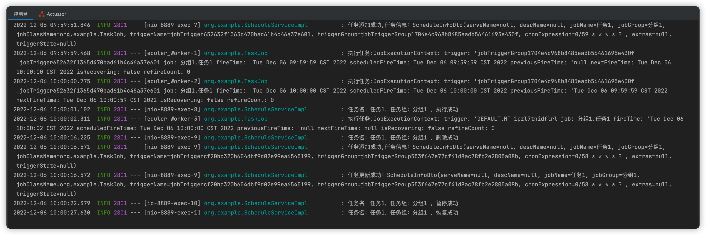
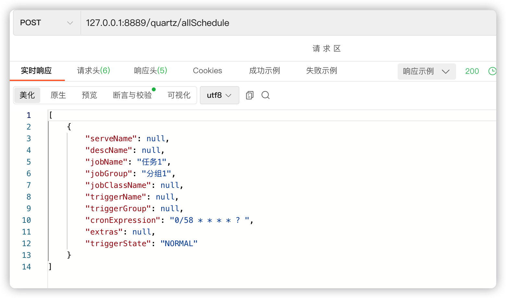
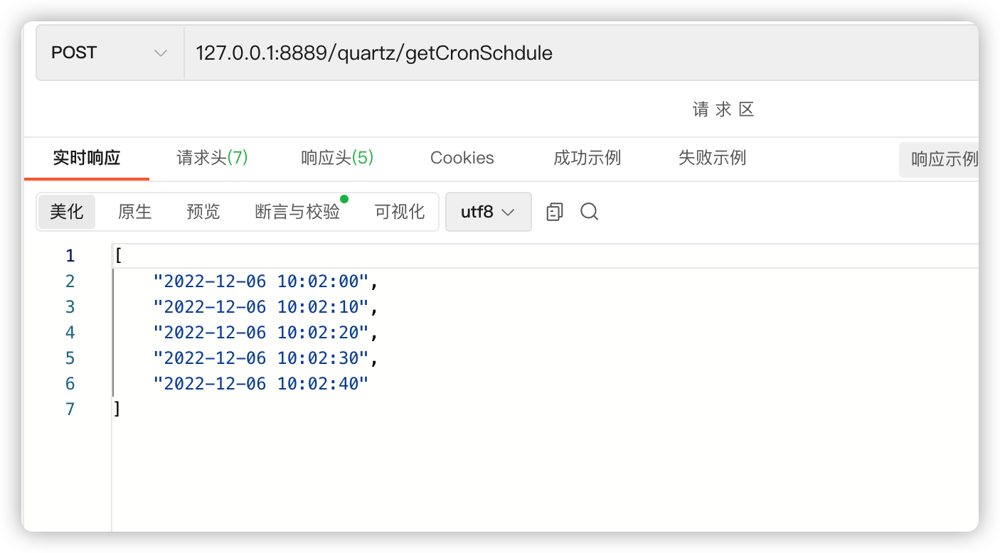

# Springboot集成quartz实现动态管理定时任务

## 实现功能：

- 1.动态添加，停止，更新，删除任务
- 2.根据cron表达式查询最近n次执行时间
- 3.持久化定时任务（mysql）

## API接口

- 添加 /quartz/addjob
- 执行一次 /quartz/executeOnce
- 任务列表 /quartz/allSchedule
- 更新任务时间 /quartz/updateSchedule
- 暂停任务 /quartz/pauseSchedule
- 恢复任务 /quartz/resumeSchedule
- 删除任务 /quartz/deleteSchedule
- 获取任务最近5次执行时间 /quartz/getCronSchdule

